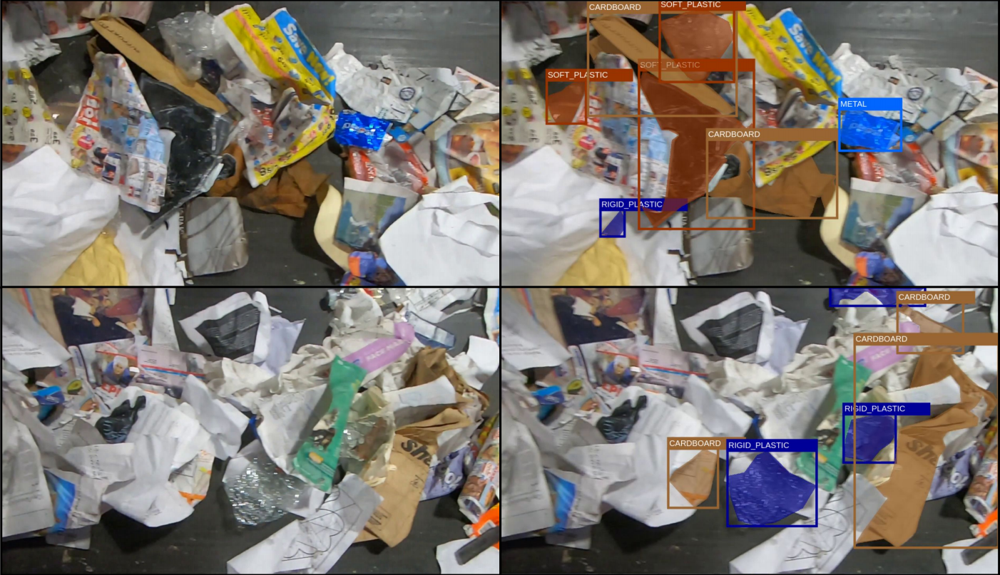

# ZeroWaste: Towards Automated Waste Recycling


This is the official repository of the ZeroWaste project [arxiv](http://a.com). Our ZeroWaste dataset distributed under 
<a rel="license" href="http://creativecommons.org/licenses/by-nc/4.0/"></a><br /><a rel="license" href="http://creativecommons.org/licenses/by-nc/4.0/">Creative Commons Attribution-NonCommercial 4.0 International License </a>  can be found [here](http://csr.bu.edu/ftp/recycle/).

## Requirements
* pytorch 1.8
* [Detectron2](https://github.com/facebookresearch/detectron2) (please see the [official installation guide](https://detectron2.readthedocs.io/en/latest/tutorials/install.html))

## Training
To train the supervised methods (DeeplabV3+ or Mask R-CNN), use the command below: 
```
# train deeplab on ZeroWaste data
python deeplab/train_net.py --config-file deeplab/configs/zerowaste_config.yaml --dataroot /path/to/zerowaste/data/ (optional) --resume OUTPUT_DIR /deeplab/outputs/*experiment_name* (optional) --MODEL.WEIGHTS /path/to/checkpoint.pth
```

## Evaluation
The checkpoints for the experiments reported in our paper can be found [here](http://csr.bu.edu/ftp/recycle/models/). Please use the following code to evaluate the model on our dataset:
```
# evaluate the pretrained deeplab ZeroWaste:
python deeplab/train_net.py --config-file deeplab/configs/zerowaste_config.yaml --dataroot /path/to/zerowaste/data/  --eval-only OUTPUT_DIR /deeplab/outputs/results/ --MODEL.WEIGHTS path/to/checkpoint.pth
```